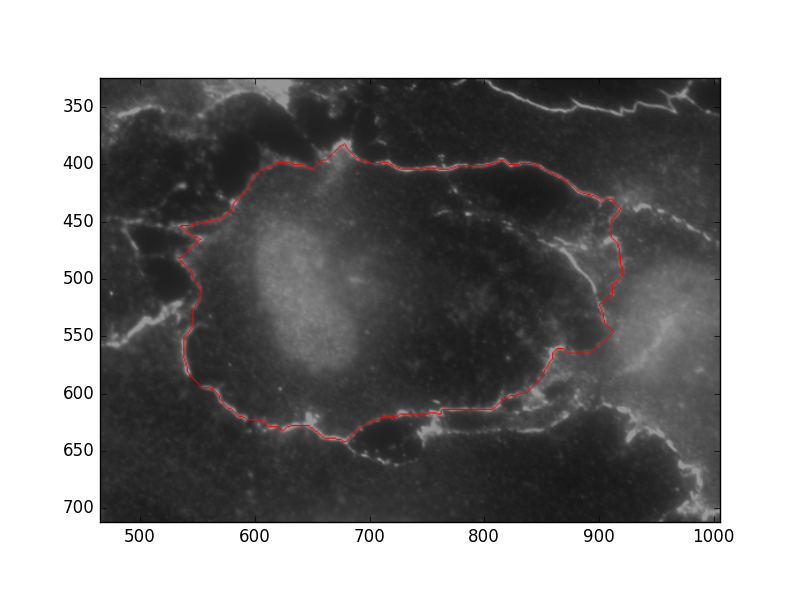

## Installation

### Windows

The Python(x,y) distribution has all of the tools needed. Download it here: http://python-xy.github.io/downloads.html 

If you don't do the full installation, make sure you go through the list and include:

- OpenCV
- Scipy
- Numpy
- scikit-image
- Matplotlib


## Terms

- Sector - Piece of an image

- Cell

- Segment - Piece of a cell wall. 

  These are not defined by waypoints (i.e. a segment can include and pass through a waypoint)


## Feature Marking

- Waypoints

  Pure Blue (#0000FF or (0, 0, 255))

  Followed by program as a general outline of the cell - don't need to be perfectly accurate.
  
  **Note:** It is important when adding these to pay attention to the behavior of your image editor of choice. For example, in Gimp the paint brush will create "soft" edges instead of just setting all of the pixels to the value you selected. In Gimp make sure to use the pencil tool. 

- Redlines

  Pure Red (#FF0000 or (255, 0, 0))

  Will not be crossed when expanding a segment

  Fully redlined regions will be ignored when doing feature searches

- Regions

  Boxes that mark a region of interest - i.e. perpendicular region

  Segments within regions will be analyzed separately

## Examples

### Waypoints

Example files are located in the directory `examples/waypoints`. `features.tif` shows an example of marked waypoints.

To run this example:

```
python run.py --path-check ../examples/waypoints/
```

This will show the computed path based on the waypoints provided. 


