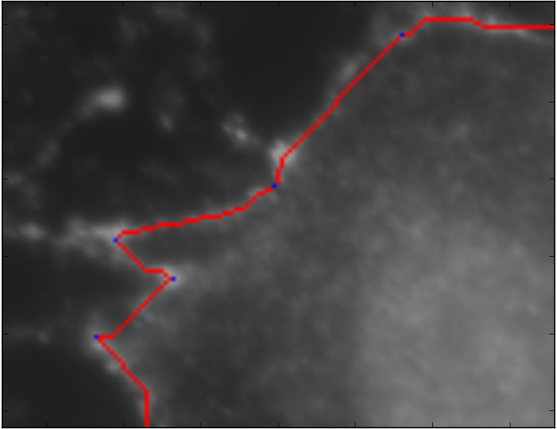

## Overview

For the full run, this is an outline of the process:

- Program is supplied with the path to a folder that contains a file named `input.tif` and `features.tif` as well as any options
  - `input.tif` is the original image
  - `features.tif` is an image that contains **Feature Marks** as outlined below
  - A full list of options can be found using the flag `--help`, most options are outlined below as well
- Waypoints are used to find the perimeter of the cell
- Shape factors are calculated (area, convex hull area, perimeter, solidity, circularity, aspect ratio)
  - Solidity, circularity and aspect ratio are dimensionless
  - Perimeter is in `px`
  - Area and convex hull area are in `px^2` 


## Installation

### Windows

The Python(x,y) distribution has all of the tools needed. Download it here: http://python-xy.github.io/downloads.html 

If you don't do the full installation, make sure you go through the list and include:

- OpenCV
- Scipy
- Numpy
- scikit-image
- Matplotlib


## Terms

- Sector - Piece of an image

- Cell

- Segment - Piece of a cell wall. 

  These are not defined by waypoints (i.e. a segment can include and pass through a waypoint)


## Feature Marking

Feature marking is a way of guiding the algorithm. You will add marks with specific colors to a copy of the image called `features.tif` (or `features.png`, etc). Each mark gives different guidance to the algorithms. 

- Add **waypoints** to guide the algorithm finding the cell perimeter. 
- Add **regions** to include segments for analysis that do not fall on the perimeter.
- Add **redlines** to prevent something from being included.

### Waypoints 

Waypoints mark a general path for computing the perimeter of the cell. 
 
The edge finding algorithm works by finding the Minimum Cost Path between each waypoint. The cost matrix is calculated by inverting the intensity of each pixel in the image by subtracting it from 255 (each pixel is an 8 bit integer, `2^8 - 1 = 255` (range starts at 0 not 1)). 
  
By finding the minimum cost path, it is effectively finding the shortest but brightest path between the two points. 

Waypoints are added to the image as a single pixel colored pure blue (Hex: #0000FF, RGB: (0, 0, 255)). They should be added when the minimum cost path between two points won't necessarily be the best estimation of the cell's edge. You can add additional waypoints to shorten the distance between waypoints, making it more costly for the algorithm to go out of the way. 

As an example, the minimum cost path in this figure does not follow the apparent cell edge. 


By adding 3 waypoints you can redirect the path finding algorithm to include the convex region. 



**Note:** It is important when adding these to pay attention to the behavior of your image editor of choice. For example, in Gimp the paint brush will create "soft" edges instead of just setting all of the pixels to the value you selected. In Gimp make sure to use the pencil tool. 
  
 Brush tool: 
 
 
 
 Pencil tool:
 
 
 
#### Example

Example files are located in the directory `examples/waypoints`. `features.tif` shows an example of marked waypoints.

To run this example:

```
python run.py --path-check ../examples/waypoints/
```

This will show the computed path based on the waypoints provided. 


#### Workflow

The `--path-check` flag will only run the path finding between waypoints and display the result. This will allow you to quickly test your waypoints without waiting for the longer parts of the program to run.   


### Regions

Boxes that mark a region of interest - i.e. perpendicular region

Segments within regions will be analyzed separately

### Redlines

Pure Red (#FF0000 or (255, 0, 0))

Will not be crossed when expanding a segment

Fully redlined regions will be ignored when doing feature searches


## Options


## Examples


### Shape Factors


